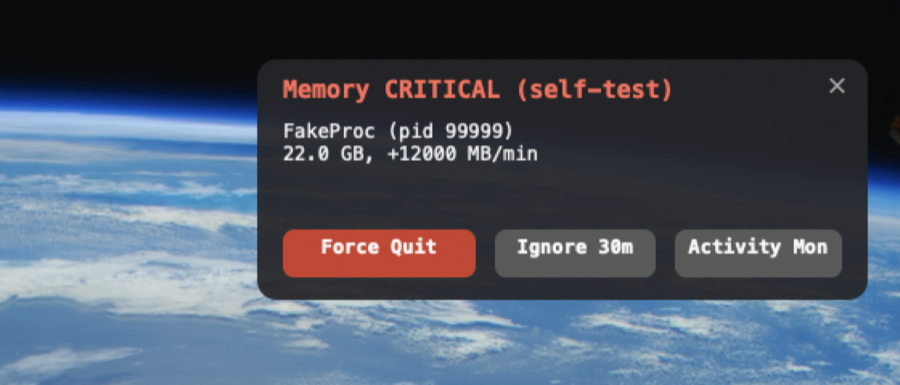

# memwatch

A menu-bar memory early-warning system for macOS, driven by Hammerspoon. It
exists to prevent a repeat of the 2026-05-29 unrecoverable freeze (a
memory-compressor thrash livelock on this 36 GB machine) and the 2026-07
Chrome runaway that nearly repeated it: detect that memory demand is actively
degrading the system while there is still headroom, name the runaway process
immediately, and end it in one click.

## The model: dynamics, not levels

Absolute compressor and swap sizes are useless as alarms on macOS. They are
cumulative and homeostatic: the kernel will happily hold 30 GB in the
compressor and 8 GB of swap for days while reporting normal pressure, and it
defends a low free-page equilibrium by design. A gauge keyed to absolute
levels goes red and stays red, which is the same as never alerting at all.

What actually predicts the beachball is motion:

| Signal | Source | Why it matters |
|--------|--------|----------------|
| Swap-out rate | `swapOuts` counter delta (native `hs.host.vmStat()`) | sustained disk eviction means the compressor is full; a storm is the thrash signature |
| Compression rate | `pagesCompressed` counter delta | how hard the compressor is being fed right now |
| Kernel pressure level | `sysctl kern.memorystatus_vm_pressure_level` | the OS's own verdict (1 normal / 2 warn / 4 critical) |
| Available headroom | free + speculative + purgeable + file-backed pages | only meaningful paired with active compression, never alone |
| Per-process growth | footprint weight per pid: `ps` RSS + sticky per-pid compressed size from `top` | the runaway catcher: what is CLIMBING, not what is big; weight stays visible even when the kernel compresses a fast allocator's pages away in real time |

## States

An always-present dot in the menu bar, quiet until something is wrong:

| State | Look | Enters when (confirmed over consecutive ticks) |
|-------|------|-----------------------------------------------|
| `ok` | dim green dot, no text | default |
| `elevated` | amber dot, watch hint (`● Chrome↑`) when a grower is watched | kernel warn, sustained swap-out, compression storm, or thin headroom under active compression (~10s confirm) |
| `critical` | red dot naming the offender (`● Chrome 22G`) or the cause (`● SWAP`) | swap-out storm or floor-level headroom under compression (~10s); kernel critical or a confirmed extreme runaway immediately |

Downgrades are deliberately slower than upgrades: a minimum dwell (30s out of
critical, 20s out of elevated) plus consecutive genuinely-calm ticks with exit
thresholds below entry thresholds. The state cannot flap.

## Runaway detection

Per-pid footprint-weight history rings (RSS plus that pid's compressed size,
sticky between `top` refreshes), judged over the rising tail so an old flat
stretch never dilutes a fresh climb. One flat tick between rises is tolerated
(the compressed component refreshes on `top`'s slower cadence); two
consecutive flats or any real drop end the streak:

- **Extreme growth** (>= 150 MB/s across ~20s of climb, or >= 6 GB net window
  growth while still climbing): fires even while the system is still `ok`
  and forces `critical`. This is the Chrome-runaway catcher; the point is to
  act while there is headroom left. An extreme verdict latches for 45s: RSS
  collapsing because the kernel is compressing the runaway must never read
  as recovery. A killed pid still clears the books within two ticks
  (runaways are only reported for pids seen alive in the last 12s).
- **Sustained growth** (>= 1.5 GB/min across ~20s): a watch (amber hint) while
  the system is `ok`, an alert once it is `elevated`.
- **Absolute footprint** (>= 40% of RAM by weight): attribution only while the
  system is already `critical`. A steady 20 GB local model server never
  alarms on size.
- **No proven runaway at `critical`**: the largest process by weight is named
  as attribution, explicitly tagged "largest process, not growing" on every
  surface, and the menu-bar title shows the systemic cause (`● SWAP`) instead
  of the bystander's name.

Hog ranking joins fresh `ps` RSS with the top stream's per-process `CMPRS`:
a runaway whose pages were compressed away shows a small RSS and a huge
CMPRS, so RSS-only lists mislead exactly when it matters. pid reuse is
detected by a comm change and resets that pid's history.

## Alerts and one-click kill

On `critical` (or an extreme runaway), a small floating HUD appears under the
menu bar on every Space, without stealing keyboard focus:



**Force Quit** sends SIGTERM immediately (no confirmation), escalates to
SIGKILL after 7s if the target refuses to die, verifies death, and reports the
memory actually reclaimed. Safety rails, enforced in pure logic
(`core.killAllowed`): same-uid processes only, a curated denylist
(WindowServer, loginwindow, Finder, Dock, Hammerspoon itself, and friends),
never pid 1, never memwatch's own host. The target's identity is re-validated
by comm before TERM and again before KILL, so a recycled pid can never be
signaled. Every action and refusal is logged.

A notification breadcrumb accompanies the HUD (180s cooldown; its Force Quit
action button renders reliably only when Hammerspoon notifications are set to
the Alerts style; the HUD is the dependable surface).

The dropdown menu shows the state and its cause, kernel level, live rates,
headroom, top-5 processes by true weight (each with Force Quit / Ignore
submenus), and direct Force Quit / Ignore items for the current offender.

### Freeze (reversible)

Alongside Force Quit, the HUD and menu offer **Freeze**: a SIGSTOP that
pauses a process instantly and reversibly. It does not release the memory
(that happens on resume or quit), but it stops the growth with nothing
lost, which is the right first move for a process you are not ready to
kill. Frozen processes are tracked in a ledger that survives a Hammerspoon
reload with a start-time identity check, so nothing is ever left paused and
orphaned, and a "Frozen by memwatch" menu section resumes them.

### Unattended modes (opt-in, default OFF)

`core.cfg.unattended = "off" | "freeze" | "kill"` (or the local config file)
arms an unattended guard for the away-from-keyboard case: an extreme-growth
runaway while critical, whose HUD has gone unanswered for the grace window,
is frozen or killed through the same policy-checked flow, loudly logged and
notified. `freeze` is the recommended reversible default. The legacy
`autoKill = true` still works and maps to `unattended = "kill"`. Leave it
off until the detector has earned your trust.

### LFM adjudication (opt-in, default OFF)

An optional on-device LFM2.5 model can adjudicate the unattended decision,
choosing wait, freeze, or terminate inside the deterministic rails at zero
marginal cost. It is off by default; a plain install is exactly the
deterministic sentinel. Enable with `./install.sh --with-lfm` or the menu
toggle. See [docs/lfm-adjudication.md](docs/lfm-adjudication.md) and the
[bake-off methodology](docs/bakeoff-methodology.md); the model weights are
licensed separately (`NOTICE-LFM`).

## Layout

```
~/projects/memwatch/
  lua/memwatch_core.lua   pure: metrics, rates, signals, state machine, title, kill policy
  lua/memwatch_procs.lua  pure: ps/top parsers, growth rings, runaway detection, ranking
  lua/memwatch_lfm.lua    pure: LFM JSON codec, prompt, serializer, validator, rails (opt-in)
  lua/memwatch_report.lua pure: the value report renderer (opt-in)
  lua/memwatch.lua        Hammerspoon glue: timers, async sampling, HUD, menu, kill/freeze, LFM lifecycle, log
  test_core.lua           unit tests for the pure modules (lua test_core.lua)
  test_report.lua         unit tests for the report renderer (lua test_report.lua)
  eval/                   the model bake-off: corpus, runner, gates, methodology
  install.sh              idempotent wiring into ~/.hammerspoon/init.lua (with backup); --with-lfm adds adjudication
  memwatch.log            state transitions, runaways, kills, errors; rotates at 1 MB
```

The verdict is fork-free: signals and the state machine run every 5s tick
from native `hs.host.vmStat()` counters plus the last-known kernel level, so
the gauge keeps deciding while the system is dying. Enrichment arrives on two
async feeds: a consolidated `sysctl` + full `ps` fork per tick (streaming
drain, in-flight guard, watchdog; a failed or starved fork degrades to stale
process data, never to a wrong verdict, and the menu says so), and a single
persistent `top -l 0` stream, spawned at the onset of pressure while spawning
still works, feeding per-pid footprint (MEM + CMPRS) right through a storm in
which forking anything new starves for tens of seconds. Live drills measured
every one of those failure modes before this shape settled.

## Install

Requires [Hammerspoon](https://www.hammerspoon.org). The install script wires
`~/projects/memwatch`, so clone to that path:

```sh
git clone https://github.com/rgsuarez/memwatch.git ~/projects/memwatch
bash ~/projects/memwatch/install.sh
```

Appends a `BEGIN memwatch / END memwatch` block to `~/.hammerspoon/init.lua`
(after backing it up), adds the project `lua/` dir to `package.path`, and
`require("memwatch")`, then reloads Hammerspoon. Re-running is safe.

## Test

Pure-logic unit tests (state machine, detector, kill policy, parsers):

```sh
cd ~/projects/memwatch && lua test_core.lua
```

Visual self-test and full-surface simulation (no real process involved; the
fake offender probes as already exited, so clicking Force Quit is safe):

```sh
hs -c "memwatch.test('elevated')"    # amber title for 12s
hs -c "memwatch.test('critical')"    # red title + notification + HUD
hs -c "memwatch.simulate()"          # runaway-alert demo for 20s
hs -c "memwatch.status()"            # one-line current reading
```

Live end-to-end drill with a real (bounded, safe) leaker: allocate ~190 MB/s
up to an 8 GB cap, watch the HUD name `python3` within ~40s, and click Force
Quit:

```sh
python3 -c 'import time
a = []
step = 48 * 1024 * 1024
while len(a) * step < 8 * 1024**3:
    a.append(bytearray(step)); time.sleep(0.25)
print("holding", flush=True); time.sleep(600)'
```

## Uninstall

Delete the `BEGIN memwatch ... END memwatch` block from
`~/.hammerspoon/init.lua` (a backup `init.lua.bak.*` was created at install
time) and reload Hammerspoon.

## Notes

- Auto-starts at login because Hammerspoon does; no launchd job.
- Alerts are silent by design (icon + HUD + notification, no sound).
- The dot is steady by default; `core.cfg.flash = true` restores the pulse.
- Editing the module does not auto-reload (the pathwatcher only watches
  `~/.hammerspoon/`); run `hs -c "hs.reload()"` after changes.
- All thresholds live in `M.cfg` tables at the top of the two pure modules,
  sized for a 36 GB machine under a heavy dev workload (agents, node, Chrome,
  Notion); scale the rate and growth numbers with RAM if this ever moves.

## License

MIT. See [LICENSE](LICENSE).
